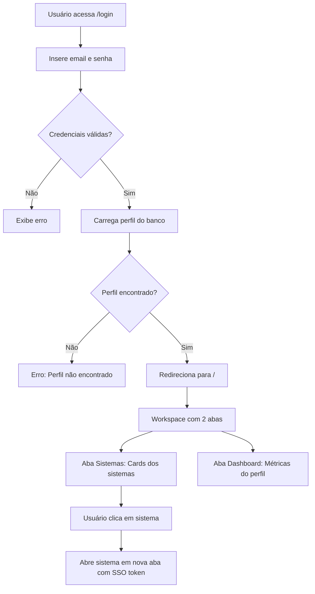

# 👥 Guia de Configuração de Usuários

**Data:** 19 de Novembro de 2024  
**Projeto:** Portal Clinic Bot

## 📋 Usuários Padrão a Criar

| Email | Nome | Função | Acesso aos Sistemas |
|-------|------|--------|---------------------|
| dr.marcio@marcioplasticsurgery.com | Dr. Marcio Scartozzoni | doctor | Agenda, Dashboard, Portal Médico, Portal Orçamento |
| admin@marcioplasticsurgery.com | Marcio Scartozzoni | admin | Todos os sistemas |
| recep@marcioplasticsurgery.com | Recepcionista | receptionist | Agenda, CRM |
| secretaria@marcioplasticsurgery.com | Secretária | secretaria | Agenda, CRM, Portal Orçamento |

## 🚀 Instalação Rápida (Método Automático)

### Passo 1: Executar Setup Completo

```bash
npm run users:full
```

Este comando irá:
1. Limpar usuários duplicados antigos
2. Criar os 4 perfis padrão no banco
3. Criar as contas de autenticação no Supabase
4. Listar todos os usuários criados

**Senha padrão:** `Clinica@2024`

### Passo 2: Testar Login

```bash
npm run dev
```

Acesse `http://localhost:3000/login` e faça login com:

```
Email: admin@marcioplasticsurgery.com
Senha: Clinica@2024
```

### Passo 3: Acessar Sistemas Integrados

Após o login, você verá duas abas:
- **Sistemas**: Cards com os 6 sistemas integrados disponíveis
- **Dashboard**: Visão geral e métricas

Clique em qualquer sistema para ser redirecionado (com SSO).

---

## 🛠️ Instalação Manual (Passo a Passo)

### Etapa 1: Limpar Usuários Antigos

```bash
npm run users:clean
```

Remove contas duplicadas e antigas:
- marcio.trabalho@gmail.com
- marcio@clinica.com
- medico@marcioplasticsurgery.com
- admin@clinica.com
- caralho@clinica.com

### Etapa 2: Criar Perfis no Banco

```bash
npm run users:setup
```

Cria os 4 perfis na tabela `user_profiles`.

### Etapa 3: Criar Contas no Supabase Auth

```bash
npm run users:create-auth
```

Cria as contas de autenticação e vincula aos perfis.

### Etapa 4: Verificar Usuários Criados

```bash
npm run users:list
```

Exibe uma tabela com todos os usuários cadastrados.

---

## 🔐 Gerenciamento de Senhas

### Redefinir Senha de um Usuário

**Opção 1: Via Dashboard Supabase**

1. Acesse https://supabase.com/dashboard
2. Vá em **Authentication** > **Users**
3. Encontre o usuário pelo email
4. Clique nos 3 pontos > **Reset Password**
5. Copie o link de redefinição ou defina uma senha

**Opção 2: Via Código**

```javascript
import { supabase } from './src/supabaseClient';

// Resetar senha
await supabase.auth.admin.updateUserById(
  'USER_ID_AQUI',
  { password: 'NovaSenha@123' }
);
```

### Alterar Senha no Primeiro Login

Os usuários devem ser instruídos a alterar a senha após o primeiro login:

1. Fazer login com `Clinica@2024`
2. Ir em **Configurações** (se admin) ou solicitar ao admin
3. Definir uma senha forte e pessoal

---

## 🎯 Sistemas Integrados

### 1. Agenda
- **URL:** https://agenda.marcioplasticsurgery.com
- **Acesso:** admin, doctor, secretaria, receptionist
- **Função:** Agendamento de consultas e cirurgias

### 2. CRM
- **URL:** https://crm.marcioplasticsurgery.com
- **Acesso:** admin, secretaria, receptionist
- **Função:** Gestão de relacionamento com pacientes

### 3. Dashboard
- **URL:** https://dashboard.marcioplasticsurgery.com
- **Acesso:** admin, doctor
- **Função:** Métricas e analytics

### 4. Portal Médico
- **URL:** https://portal-medico.marcioplasticsurgery.com
- **Acesso:** admin, doctor
- **Função:** Prontuários e gestão médica

### 5. Portal Orçamento
- **URL:** https://orcamento.marcioplasticsurgery.com
- **Acesso:** admin, doctor, secretaria
- **Função:** Criação e gestão de orçamentos

### 6. Sistema Financeiro
- **URL:** https://financeiro.marcioplasticsurgery.com
- **Acesso:** admin
- **Função:** Controle financeiro completo

---

## 📊 Controle de Acesso por Perfil

### Doctor (Médico)
✅ Agenda  
✅ Dashboard  
✅ Portal Médico  
✅ Portal Orçamento  
✅ Visualizar pacientes  
✅ Criar documentos  

### Admin (Administrador)
✅ Todos os 6 sistemas  
✅ Gerenciar usuários  
✅ Configurações  
✅ Auditoria  
✅ Acesso completo  

### Secretaria
✅ Agenda  
✅ CRM  
✅ Portal Orçamento  
✅ Gerenciar pacientes  
✅ Agendar consultas  

### Receptionist (Recepcionista)
✅ Agenda  
✅ CRM  
✅ Visualizar pacientes  
✅ Check-in/Check-out  

---

## 🔄 Fluxo de Login e Redirecionamento



---

## 🛡️ Single Sign-On (SSO)

Ao clicar em um sistema, o usuário é redirecionado com um token de autenticação:

```
https://sistema.marcioplasticsurgery.com?token=JWT_TOKEN&user=USER_ID
```

Os sistemas integrados devem:
1. Validar o token JWT
2. Criar sessão local do usuário
3. Redirecionar para dashboard do sistema

---

## 🧪 Testes

### Teste 1: Login como Admin
```bash
Email: admin@marcioplasticsurgery.com
Senha: Clinica@2024
```
**Resultado esperado:** Acesso aos 6 sistemas

### Teste 2: Login como Doctor
```bash
Email: dr.marcio@marcioplasticsurgery.com
Senha: Clinica@2024
```
**Resultado esperado:** Acesso a 4 sistemas (Agenda, Dashboard, Portal Médico, Portal Orçamento)

### Teste 3: Login como Secretaria
```bash
Email: secretaria@marcioplasticsurgery.com
Senha: Clinica@2024
```
**Resultado esperado:** Acesso a 3 sistemas (Agenda, CRM, Portal Orçamento)

### Teste 4: Login como Receptionist
```bash
Email: recep@marcioplasticsurgery.com
Senha: Clinica@2024
```
**Resultado esperado:** Acesso a 2 sistemas (Agenda, CRM)

---

## 📝 Scripts Disponíveis

```bash
# Listar todos os usuários
npm run users:list

# Limpar usuários duplicados
npm run users:clean

# Criar perfis no banco
npm run users:setup

# Criar contas no Supabase Auth
npm run users:create-auth

# Executar tudo de uma vez
npm run users:full
```

---

## ⚠️ Troubleshooting

### Erro: "User already registered"
**Solução:** O usuário já existe no Supabase Auth. Use o comando clean primeiro:
```bash
npm run users:clean
npm run users:create-auth
```

### Erro: "Profile not found"
**Solução:** O perfil não foi criado no banco. Execute:
```bash
npm run users:setup
```

### Erro: "Permission denied"
**Solução:** Verifique se `SUPABASE_SERVICE_KEY` está configurada no `.env`

### Sistema não aparece na lista
**Solução:** Verifique o role do usuário. Cada sistema tem permissões específicas.

---

## 🔒 Segurança

### Boas Práticas

1. **Alterar senhas padrão** imediatamente
2. **Usar senhas fortes** (mínimo 8 caracteres, letras, números e símbolos)
3. **Não compartilhar credenciais** entre usuários
4. **Desativar usuários inativos** (em vez de deletar)
5. **Fazer backup** antes de mudanças em massa
6. **Monitorar logs** de auditoria regularmente
7. **Revisar permissões** periodicamente

### Políticas de Senha Recomendadas

- Mínimo 8 caracteres
- Pelo menos 1 letra maiúscula
- Pelo menos 1 número
- Pelo menos 1 caractere especial
- Não usar dados pessoais
- Trocar a cada 90 dias

---

## 📞 Suporte

Para problemas ou dúvidas:

1. Consulte a documentação: `/docs`
2. Verifique os logs: `npm run users:list`
3. Acesse o Dashboard Supabase
4. Entre em contato com o suporte técnico

---

## ✅ Checklist Final

- [ ] Executei `npm run users:full`
- [ ] Testei login com cada perfil
- [ ] Verifiquei acesso aos sistemas
- [ ] Alterei as senhas padrão
- [ ] Configurei 2FA no Supabase (admin)
- [ ] Documentei senhas de forma segura
- [ ] Treinei usuários no uso do sistema
- [ ] Configurei backup automático

---

**Status:** ✅ Guia completo e pronto para uso!

**Próximos Passos:**
1. Execute `npm run users:full`
2. Faça login e teste os sistemas
3. Altere as senhas padrão
4. Configure os sistemas integrados
